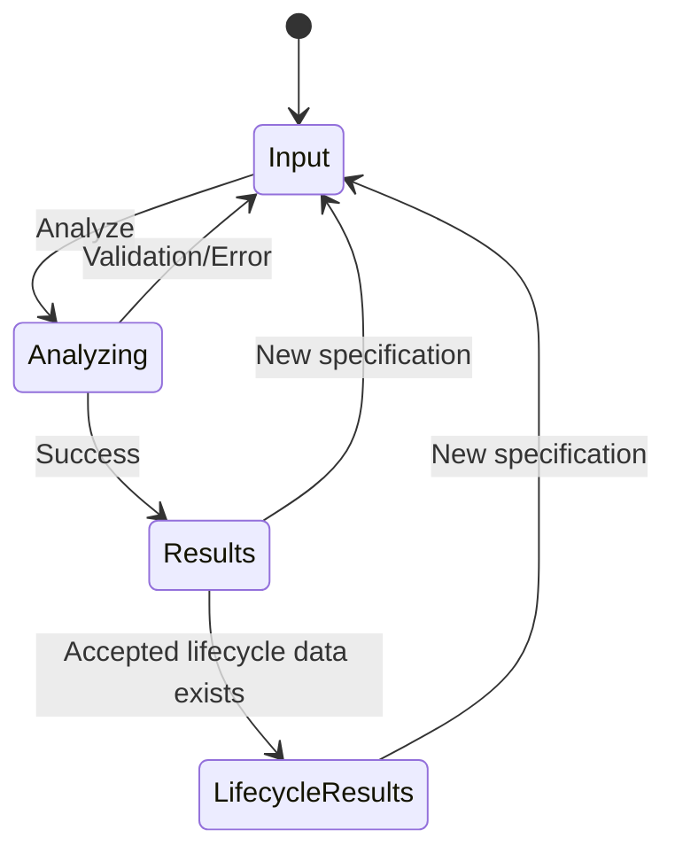

# Research UI v1 design specification

**Design ID:** `RESEARCH-UI-V1-DESIGN`

**Design version:** `1`

**Milestone:** Research UI v1 (#5)

**Umbrella issue:** #170

**Contract authority:** [`research-ui-v1-contract.md`](research-ui-v1-contract.md)

**Status:** `APPROVED_DESIGN_BASELINE_FOR_RUI_V1`

## 1. Purpose and authority

This document is the canonical visual and interaction design specification for
Research UI v1. It translates the frozen application/presentation contract into
a concrete page structure, component system, information hierarchy, visual
language, and interaction model that later Research UI issues can implement.

This document is subordinate to the scientific and application contracts. If a
visual design choice conflicts with
[`research-ui-v1-contract.md`](research-ui-v1-contract.md), the contract wins.
If either UI document appears to require a new scientific rule, implementation
must stop and the scientific contract must be amended separately.

Research UI v1 is a **local research demonstration prototype**, not a
production SaaS product.

The primary workflow is:

```text
one specification -> Analyze -> one assessment result
```

The design must make that path immediate and simple. It must not expose the
internal complexity of `FullModelRequest` as a pre-analysis user form.

## 2. Design principles

The interface should feel like a scientific analysis workspace rather than an
administrative dashboard or commercial scoring product.

The design MUST prioritize:

1. exact values over decorative charts;
2. traceability over summarization;
3. source evidence over unexplained scores;
4. explicit absence/unavailability over fabricated completeness;
5. semantic neutrality over generic red/green success language;
6. one clear primary action per workflow state;
7. progressive disclosure of technical detail;
8. Ukrainian and English parity from the first implementation.

The design MUST NOT introduce:

- an overall quality score;
- gauges that imply a universal percentage of quality;
- traffic-light semantics for `COMPUTED`, `AVAILABLE`, or `SATISFIED`;
- inferred scientific conclusions;
- hidden scientific defaults;
- a pre-analysis Full Model parameter wizard for ordinary input.

## 3. Application states

Research UI v1 has three high-level presentation states.



The ordinary specification-only path ends at `Results`.

Formal reassessment/comparison is not enabled merely because an initial result
exists. It is available only when the canonical response already contains every
accepted lifecycle prerequisite described by the frozen contract. The accepted
controlled demonstration scenario may contain such records.

## 4. Global application shell

### 4.1 Desktop target

The prototype is desktop-first.

Primary design target:

- viewport: 1280-1600 px wide;
- top header: 64 px;
- result sidebar: 240-256 px;
- main content maximum readable width: 1180 px;
- page gutter: 32 px on standard desktop, 24 px on smaller desktop/tablet;
- minimum supported prototype width: approximately 900 px.

Below the minimum width, navigation may collapse to a drawer. Mobile-first
optimization is outside Research UI v1 scope.

### 4.2 Header

The header is persistent.

```text
+--------------------------------------------------------------------+
| Requirements Quality Assessment     Research Prototype      UA | EN |
+--------------------------------------------------------------------+
```

Left group:

- product name: **Requirements Quality Assessment**;
- secondary badge/text: **Research Prototype**.

Right group:

- `UA | EN` language toggle;
- after a result exists: **New specification** secondary action.

The language toggle changes presentation only and never reruns analysis.

### 4.3 Result sidebar

The sidebar is hidden on the initial input screen and appears after a successful
analysis.

Ordinary initial result navigation:

```text
Overview
Requirements
Specification
Product Quality
Risk
Corrective Actions
Process
Audit
```

Conditional lifecycle navigation:

```text
Reassessment
Comparison
```

The conditional entries appear only when the accepted response contains the
corresponding legitimate lifecycle records. They must not appear as disabled
promises on an ordinary specification-only result.

## 5. Visual design system

### 5.1 Color tokens

Use a restrained neutral research-tool palette.

| Token | Value | Use |
|---|---:|---|
| `--color-page` | `#F6F8FB` | application background |
| `--color-surface` | `#FFFFFF` | cards, panels, sidebar |
| `--color-surface-subtle` | `#F9FAFB` | nested/secondary blocks |
| `--color-border` | `#DCE2EA` | standard borders |
| `--color-border-strong` | `#C7D0DC` | focused structural borders |
| `--color-text` | `#17202A` | primary text |
| `--color-text-muted` | `#667085` | metadata/help text |
| `--color-accent` | `#315EFB` | selected navigation, primary action |
| `--color-accent-subtle` | `#EEF3FF` | selected/background emphasis |
| `--color-warning` | `#A15C00` | unresolved/attention states |
| `--color-warning-bg` | `#FFF7E8` | warning callouts |
| `--color-critical` | `#B42318` | confirmed problem/risk alert only |
| `--color-critical-bg` | `#FFF1F0` | confirmed problem/risk callout |
| `--color-code-bg` | `#F2F4F7` | technical IDs/code values |

Do not map generic “positive” states to green. In particular:

- `COMPUTED`: neutral/accent styling, never green;
- `AVAILABLE`: neutral/accent styling;
- `SATISFIED`: accent styling, never release-success green;
- `UNKNOWN` / `UNRESOLVED`: warning styling;
- `NOT_APPLICABLE` / missing section `UNAVAILABLE`: neutral muted styling;
- confirmed supported problem or explicit risk identification MAY use critical
  styling because the record itself represents an adverse research finding.

Color is always accompanied by a text label/icon; color alone never carries
meaning.

### 5.2 Typography

Use the platform/system sans-serif stack in v1 to avoid a font delivery
dependency.

Recommended scale:

| Role | Size / weight |
|---|---|
| Page title | 28 px / 600 |
| Section title | 20 px / 600 |
| Card title | 16 px / 600 |
| Body | 14 px / 400 |
| Emphasized body | 14 px / 600 |
| Metadata/caption | 12 px / 400 |
| Exact primary value | 24-28 px / 600 |
| Technical IDs | 12-13 px / monospace |

Canonical IDs, rule IDs, model IDs, exact transport representations, and audit
technical fields use a monospace system stack.

### 5.3 Spacing and surfaces

Use a 4 px base spacing scale:

`4, 8, 12, 16, 24, 32, 40, 48`.

Defaults:

- card padding: 20-24 px;
- section gap: 24 px;
- grid gap: 16 px;
- border radius: 8 px;
- input radius: 6 px;
- card border: 1 px solid `--color-border`;
- shadows: minimal; use borders and surface contrast first.

## 6. Shared interaction conventions

### Primary button

Used for one main action such as **Analyze**.

- accent background;
- clear loading state;
- disabled only for invalid local form state;
- no scientific meaning attached to its color.

### Secondary button

Used for:

- New specification;
- clear/replace input;
- opening additional detail;
- controlled demonstration action where appropriate.

### StatusBadge

Status badges show canonical state with localized display text.

A badge must never transform:

- `COMPUTED` into “Good”;
- `SATISFIED` into “Approved”;
- `INCREASED` into “Improved”.

### UnavailableState

Use a consistent quiet panel:

```text
Not available for this analysis

This result requires external evidence that was not supplied.
No value was inferred.
```

The exact reason is selected from canonical availability/reason codes.

### Scientific limitation callout

Use a persistent informational callout when a page could be over-interpreted,
for example:

- observed PE indicator is bounded and not complete PE;
- checkpoint satisfaction is not release authorization;
- comparison does not prove causality.

## 7. Page 0 — Specification input

### Goal

Make the ordinary workflow obvious: provide one specification and analyze it.

There is no result sidebar on this page.

### Wireframe

```text
+--------------------------------------------------------------------+
| Requirements Quality Assessment     Research Prototype      UA | EN |
+--------------------------------------------------------------------+

                     Analyze specification
             Upload a file or paste requirements.

        +------------------------------------------------+
        |                                                |
        |             Drop specification here            |
        |                 or choose file                 |
        |                                                |
        +------------------------------------------------+

                         — or paste —

        +------------------------------------------------+
        | R001 / first requirement text                  |
        | R002 / second requirement text                 |
        | ...                                            |
        +------------------------------------------------+

        Parsed requirements: 6

        [ Load demonstration example ]        [ Analyze ]

        The demonstration example uses predefined research
        fixture data and is not a scientific default.
```

### Required behavior

- file upload is client-side;
- pasted and uploaded inputs normalize to the same accepted requirement list;
- show parsed non-empty requirement count before submission;
- allow replacing/clearing input;
- preserve source text exactly after the accepted reader trimming policy;
- ordinary input does not show product/environment/risk/prediction/revision
  forms;
- `Load demonstration example` is visually secondary and explicitly labeled as
  predefined research fixture data;
- empty input receives inline validation before submission.

### UA/EN primary labels

| Key | Ukrainian | English |
|---|---|---|
| page title | Аналіз специфікації | Analyze specification |
| upload | Завантажити специфікацію | Upload specification |
| paste | Вставте вимоги | Paste requirements |
| analyze | Аналізувати | Analyze |
| demo | Завантажити демонстраційний приклад | Load demonstration example |

## 8. Page state — Analysis in progress

This is not a scientific result page.

### Wireframe

```text
+--------------------------------------------------------------+
|                    Analyzing specification                   |
|                                                              |
|                         [ spinner ]                           |
|                                                              |
|  The model is evaluating the supplied specification.         |
|  Results will appear when the analysis is complete.          |
+--------------------------------------------------------------+
```

Use indeterminate progress unless the backend exposes truthful stage progress.

The UI may list the conceptual model stages as explanatory text, but must not
animate them as completed server stages unless completion is actually known.

On API error:

- retain the user's input;
- show localized safe error text selected from the canonical error code;
- never show traceback/local paths/raw exception;
- provide **Try again** where appropriate.

## 9. Results shell

After a successful analysis:

```text
+--------------------------------------------------------------------+
| Requirements Quality Assessment     Research Prototype      UA | EN |
+----------------------+---------------------------------------------+
| Overview             |                                             |
| Requirements         |  Page header                                |
| Specification        |  -----------------------------------------  |
| Product Quality      |                                             |
| Risk                 |  Page content                               |
| Corrective Actions   |                                             |
| Process              |                                             |
| Audit                |                                             |
|                      |                                             |
+----------------------+---------------------------------------------+
```

Sidebar selected state uses accent text/background, not a colored vertical
score indicator.

The main area always begins with:

- page title;
- short explanatory subtitle;
- analysis/artifact identity metadata where useful;
- relevant limitation callout where the page is scientifically bounded.

## 10. Page 1 — Overview

### Goal

Provide a compact map of the assessment without inventing an integrated score.

### Wireframe

```text
Overview
Full Model research assessment

Requirement quality
+------------------+ +------------------+ +------------------+
| Completeness     | | Verifiability    | | Unambiguity      |
| 5/6              | | 2/3              | | 5/6              |
| COMPUTED         | | COMPUTED         | | COMPUTED         |
+------------------+ +------------------+ +------------------+

Specification
+----------------------------------------------------------+
| QB consistency                  4/5     COMPUTED          |
+----------------------------------------------------------+

Model surface
+-----------------------+ +-----------------------+
| Product Quality       | | Risk                  |
| UNAVAILABLE           | | UNAVAILABLE           |
| external evidence     | | external operands     |
+-----------------------+ +-----------------------+

+-----------------------+ +-----------------------+
| Corrective Actions    | | Process / Checkpoint  |
| UNAVAILABLE           | | UNAVAILABLE           |
+-----------------------+ +-----------------------+

[ scientific limitation callout ]
```

### Rules

- no overall score;
- no donut/gauge showing “quality percentage”;
- requirement C/V/U remain separate;
- QB remains separate from C/V/U;
- unavailable downstream areas are visible as unavailable, not omitted or
  fabricated;
- a controlled demo may show available downstream records from the accepted
  fixture.

`ModelPipeline` may appear below the cards as a neutral lineage diagram showing
which accepted stages produced records and which are unavailable.

## 11. Page 2 — Requirements

### Goal

Explain each requirement assessment and connect every displayed result to exact
source evidence.

### Layout

Two-column master/detail layout:

- left: requirement navigator, approximately 280 px;
- right: selected requirement detail.

### Wireframe

```text
Requirements

+----------------------+----------------------------------------------+
| R001                 | R001                                         |
| R002                 |                                              |
| R003                 | Якщо сервіс недоступний, система повинна... |
| ...                  |                                              |
|                      | Requirement quality                           |
|                      | +-----------+ +-----------+ +-----------+    |
|                      | | C = 1     | | V = 1     | | U = 1     |    |
|                      | +-----------+ +-----------+ +-----------+    |
|                      |                                              |
|                      | Full property profile                        |
|                      | [property rows with source/provenance]       |
|                      |                                              |
|                      | Evidence                                     |
|                      | [Condition] [Result] [Criterion]              |
|                      |                                              |
|                      | Findings / Diagnostics                       |
+----------------------+----------------------------------------------+
```

### Evidence interaction

Selecting an `EvidenceBadge`:

1. highlights the exact source span in the unchanged requirement text;
2. opens or focuses `EvidenceDrawer`;
3. shows exact evidence identity, offsets, rule, provenance, and reasons.

The drawer appears from the right and does not replace the page.

### Requirement quality cards

Each C/V/U card contains:

- localized characteristic name;
- exact value if present;
- canonical/localized state label;
- short bounded explanation;
- evidence count/action.

The nine-property profile, when available, clearly marks the source of each
property:

- automatic accepted calculation;
- external/expert assessment;
- unavailable/unknown/not-applicable.

No property is silently treated as zero.

## 12. Page 3 — Specification

### Goal

Show specification-level aggregation and QB without collapsing them into one
quality number.

### Wireframe

```text
Specification

Specification quality
+------------------+ +------------------+ +------------------+
| Completeness     | | Verifiability    | | Unambiguity      |
| 5/6              | | 2/3              | | 5/6              |
| COMPUTED         | | COMPUTED         | | COMPUTED         |
| computed 5       | | computed 4       | | computed 5       |
| unknown 1        | | unknown 2        | | unknown 1        |
+------------------+ +------------------+ +------------------+

QB consistency
+-----------------------------------------------------------+
| Exact value        4/5                                    |
| State              COMPUTED                               |
| Coverage / scope   ...                                    |
+-----------------------------------------------------------+

Requirement contributions
+------+----------+----------+-------------+
| ID   | C        | V        | U           |
+------+----------+----------+-------------+
| R001 | 1        | 1        | 1           |
| R002 | 2/3      | UNKNOWN  | 1/2         |
+------+----------+----------+-------------+
```

Rows link back to the corresponding Requirement detail view.

Exact fractions remain exact strings/structured exact values from the API.

## 13. Page 4 — Product Quality

### Goal

Present the model's product-quality surface while preserving distinctions among
criterion, observation, `X_PE`, observed quality, and prediction.

### Available-state layout

```text
Product Quality

Selected criterion
+-----------------------------------------------------------+
| Requirement R001                                         |
| Response time <= 2 s                                     |
+-----------------------------------------------------------+

Observation & conformance
+----------------------------+ +----------------------------+
| Observed value 1.8 s       | | Conformance SATISFIED      |
+----------------------------+ +----------------------------+

Performance Efficiency feature profile (X_PE)
[ feature table / applicability / provenance ]

Observed product-quality evidence
+-----------------------------------------------------------+
| Value ...                                                 |
| OBSERVED_REFERENCE_INDICATOR                              |
| Calibration / coverage ...                                |
+-----------------------------------------------------------+

Predicted product quality
+-----------------------------------------------------------+
| Predicted value ...                                       |
| Predictor / parameters / calibration ...                  |
+-----------------------------------------------------------+

[ limitation: observed != predicted; bounded PE != full PE ]
```

### Ordinary specification-only state

If external/runtime evidence is absent, keep the page in navigation and render
the section-level `UnavailableState` blocks. Do not generate a fake observation
from a textual requirement threshold.

Observed and predicted results must never share one unlabeled value card.

## 14. Page 5 — Risk

### Goal

Present supported problem/defect relations and both risk forms without merging
their semantics.

### Wireframe

```text
Risk

Supported problem / defect relation
+-----------------------------------------------------------+
| Problem ...                                               |
| Relation to Performance Efficiency ...                    |
+-----------------------------------------------------------+

Categorical risk
+-----------------------------------------------------------+
| RISK_IDENTIFIED                                           |
| Applicability ...                                         |
| Calibration ...                                           |
+-----------------------------------------------------------+

Quantitative local risk
+-----------------------------------------------------------+
| Exact r_ij ...                                            |
| rho ...  p ...  I ...  kappa ...                         |
| Scope LOCAL                                               |
| Calibration ...                                           |
+-----------------------------------------------------------+

[ limitation: categorical != quantitative; local != global ]
```

For an ordinary specification-only run, unavailable risk records show explicit
unavailability rather than `0` or “no risk”.

## 15. Page 6 — Corrective Actions

### Goal

Render accepted action/revision records without claiming that the system writes
or proves the effectiveness of a revision.

### Wireframe

```text
Corrective Actions

Action
+-----------------------------------------------------------+
| Action kind ...                                           |
| Target ...                                                |
| Status PROPOSED / APPLIED / REJECTED                      |
| Rule / provenance ...                                     |
+-----------------------------------------------------------+

External revision
+-----------------------------------------------------------+
| Parent artifact ...                                       |
| Child artifact ...                                        |
| Changed requirements ...                                  |
+-----------------------------------------------------------+

[ limitation: application is not causal proof ]
```

### Reassessment entry

Do not display a generic **Reassess revised specification** button for ordinary
specification-only results.

A formal reassessment action may be rendered only when the canonical response
contains every accepted lifecycle prerequisite from the frozen contract.

If Research UI later needs independent specification-only v1/v2 comparison,
that requires a separate approved contract and is not designed into v1.

## 16. Page 7 — Process

### Goal

Visualize immutable process/artifact lineage and checkpoint semantics.

### Wireframe

```text
Process

Process timeline

Specification v1
      |
      v
Initial assessment
      |
      v
Risk evaluation
      |
      v
Corrective action
      |
      v
External revision
      |
      v
Specification v2
      |
      v
Reassessment

Current process state
+-----------------------------------------------------------+
| ID / version / stage / provenance                         |
+-----------------------------------------------------------+

Checkpoint
+-----------------------------------------------------------+
| Selected result ...                                       |
| External policy ...                                       |
| Predicate ...                                             |
| Outcome SATISFIED                                         |
+-----------------------------------------------------------+

[ SATISFIED means predicate true; not RELEASE/PROCEED ]
```

Timeline nodes are rendered only from actual process-state/transition records.
The frontend must not create missing lifecycle stages merely to make the
timeline visually complete.

## 17. Page 8 — Audit

### Goal

Provide the complete technical trace from structured canonical data without
re-parsing console reporter text.

### Wireframe

```text
Audit

Full Model Audit

v Assessment
  > Requirement records
  > Specification assessment
  > Metric profile
  v Dynamic criterion binding
      status
      applicability
      criterion
      comparator
      bound
      unit
  > Observation resolution
  > Conformance
  > X_PE
  > Observed product quality
  > Prediction
  > Defect population
  > Defect-quality relations
  > Risk
  > Corrective actions
  > Process states
  > Checkpoints
  > Reassessment        (only when present)
  > Comparison          (only when present)
```

Technical values use monospace styling.

Expandable nodes must retain:

- canonical IDs;
- exact values;
- status/state/applicability;
- rule/model/parameter identities;
- reason codes;
- evidence/provenance;
- versions/calibration.

Any evidence reference can open the global `EvidenceDrawer`.

## 18. Conditional page — Reassessment

This page exists only when the accepted response contains an actual
`ReassessmentRun`.

It is not part of the ordinary specification-only initial experience.

### Wireframe

```text
Reassessment

Lifecycle
Specification v1  ->  external revision  ->  Specification v2

Reassessment identity
+-----------------------------------------------------------+
| assessment / artifact / application / revision refs       |
+-----------------------------------------------------------+

Produced v2 results
[ structured result families produced by accepted reevaluation ]

Evidence reuse
[ decisions, identity checks, provenance ]
```

The page explains that reevaluation uses accepted rules against the new
artifact. It does not describe a numeric change as improvement.

## 19. Conditional page — Comparison

This page exists only when accepted model-produced `ResultComparison` records
exist.

### Wireframe

```text
Comparison

                    BEFORE                  AFTER
Artifact            v1                      v2

Requirement R002
Completeness        2/3                     1
Verifiability       1/2                     1
Unambiguity         1/2                     1

Comparison record
+-----------------------------------------------------------+
| Kind        INCREASED                                     |
| Before ref  ...                                           |
| After ref   ...                                           |
| Reasons     ...                                           |
| Calibration ...                                           |
+-----------------------------------------------------------+

[ limitation: comparison does not prove causal effectiveness ]
```

Do not render frontend-calculated arrows or “Improved/Worsened” labels unless
those exact semantics are present in an accepted domain record. Literal
`INCREASED`, `DECREASED`, or state-change semantics may be localized without
adding interpretation.

## 20. Global EvidenceDrawer

The drawer is reusable from Requirements, Specification, Product Quality, Risk,
Corrective Actions, Process, and Audit.

### Wireframe

```text
                                      +--------------------------+
                                      | Evidence E003        [x] |
                                      +--------------------------+
                                      | Requirement R001         |
                                      |                          |
                                      | Source fragment          |
                                      | "не більше ніж за 2 с."  |
                                      |                          |
                                      | Offsets 48-66            |
                                      | Rule ...                 |
                                      | Feature ...              |
                                      | Provenance ...           |
                                      | Reason ...               |
                                      +--------------------------+
```

Opening the drawer must not mutate analysis state.

Exact source text is never translated.

## 21. Component inventory and page mapping

| Component | Input | Overview | Requirements | Specification | Product Quality | Risk | Actions | Process | Audit | Comparison |
|---|---:|---:|---:|---:|---:|---:|---:|---:|---:|---:|
| AppShell/Header | yes | yes | yes | yes | yes | yes | yes | yes | yes | yes |
| LanguageToggle | yes | yes | yes | yes | yes | yes | yes | yes | yes | yes |
| SidebarNavigation | no | yes | yes | yes | yes | yes | yes | yes | yes | yes |
| FileDropzone | yes | no | no | no | no | no | no | no | no | no |
| MetricCard | no | yes | yes | yes | limited | limited | no | no | no | yes |
| StatusBadge | no | yes | yes | yes | yes | yes | yes | yes | yes | yes |
| UnavailableState | no | yes | yes | yes | yes | yes | yes | yes | yes | yes |
| DataTable | no | optional | optional | yes | yes | yes | optional | optional | optional | yes |
| EvidenceHighlighter | no | no | yes | optional | optional | optional | optional | optional | no | no |
| EvidenceDrawer | no | optional | yes | yes | yes | yes | yes | yes | yes | optional |
| ModelPipeline | no | yes | no | no | optional | optional | optional | yes | no | no |
| AuditTree | no | no | no | no | no | no | no | no | yes | no |
| BeforeAfterComparison | no | no | no | no | no | no | no | no | optional | yes |

## 22. Localization structure

Recommended translation namespaces:

```text
common
input
overview
requirements
specification
productQuality
risk
actions
process
audit
lifecycle
errors
limitations
```

Canonical API/domain codes remain stable.

Example:

```text
canonical code: COMPUTED
uk label: Обчислено
en label: Computed
```

The localized label is presentation only. Audit can show both localized label
and canonical code where useful.

Locale switching:

- changes UI copy immediately;
- does not call `/api/v1/analyze`;
- does not translate requirement text or evidence;
- does not change exact numbers, IDs, or result semantics.

## 23. Accessibility

Minimum v1 requirements:

- all controls have explicit accessible names;
- keyboard focus is always visible;
- sidebar/navigation is keyboard reachable;
- dialogs/drawers trap and restore focus appropriately;
- status meaning is not color-only;
- text contrast targets WCAG AA;
- tables retain meaningful headers;
- evidence highlighting also exposes textual labels/metadata;
- loading state uses an accessible live region;
- reduced-motion preference is respected for nonessential transitions.

## 24. Empty, unavailable, and error-state patterns

### Empty input

Show inline validation and keep the primary page.

### Empty specification result

If the API contract later permits an empty scientific result in a specific
case, render the exact domain state rather than a UI-generated zero.

### Section unavailable

Use `UnavailableState` with:

- localized title;
- canonical reason-derived explanation;
- “No value was inferred” language where helpful.

### Unknown/unresolved record

Use the actual domain record and its reasons, not section-unavailable styling.

### API failure

Keep current input and show a localized safe error callout. No stack trace.

## 25. Responsive behavior

Research UI v1 is desktop-first.

At narrower widths:

1. metric grids collapse from 3 columns to 2 then 1;
2. Requirements master/detail may stack with requirement selector above detail;
3. sidebar may become a drawer;
4. wide tables may scroll horizontally inside their own container;
5. EvidenceDrawer may become a full-width overlay.

Do not remove scientific data merely to fit a smaller viewport.

## 26. Animation and motion

Use motion sparingly:

- 120-180 ms for drawer/collapse transitions;
- no celebratory success animation;
- no animated score gauges;
- respect `prefers-reduced-motion`.

Scientific result appearance should feel stable and inspectable.

## 27. Implementation mapping to milestone issues

| Issue | Design responsibility |
|---|---|
| #173 RUI-03 | shell, tokens, generic components, scientific primitive styling |
| #174 RUI-04 | UA/EN namespaces and language toggle |
| #175 RUI-05 | specification input/upload/demo entry |
| #176 RUI-06 | analyzing/error/session states |
| #177 RUI-07 | result shell, navigation, Overview |
| #178 RUI-08 | Requirements + evidence interactions |
| #179 RUI-09 | Specification |
| #180 RUI-10 | Product Quality |
| #181 RUI-11 | Risk |
| #182 RUI-12 | Corrective Actions and only legally eligible lifecycle entry |
| #183 RUI-13 | Process / Checkpoint |
| #184 RUI-14 | Audit |
| #185 RUI-15 | conditional formal Reassessment / Comparison only under accepted lifecycle contract |
| #186 RUI-16 | end-to-end visual/interaction acceptance |

## 28. Implementation acceptance checklist

A page/component implementation conforms to this design baseline only if:

- it derives scientific content from canonical response data;
- it does not calculate new scientific values;
- it preserves exact values and absence states;
- it follows the ordinary one-specification/one-assessment workflow;
- it never asks the ordinary user to fabricate Full Model inputs;
- it uses the approved navigation visibility rules;
- it distinguishes observed vs predicted quality;
- it distinguishes categorical vs quantitative risk;
- it preserves evidence/source text exactly;
- it does not interpret `COMPUTED` or `SATISFIED` as universal success;
- it does not claim causal effectiveness from before/after change;
- it supports both `uk` and `en`;
- it follows the shared visual tokens and component responsibilities here.

Later implementation issues MAY refine component internals for accessibility or
engineering practicality, but any material change to page structure,
scientific presentation semantics, or lifecycle visibility must update this
design specification and remain consistent with the frozen contract.
